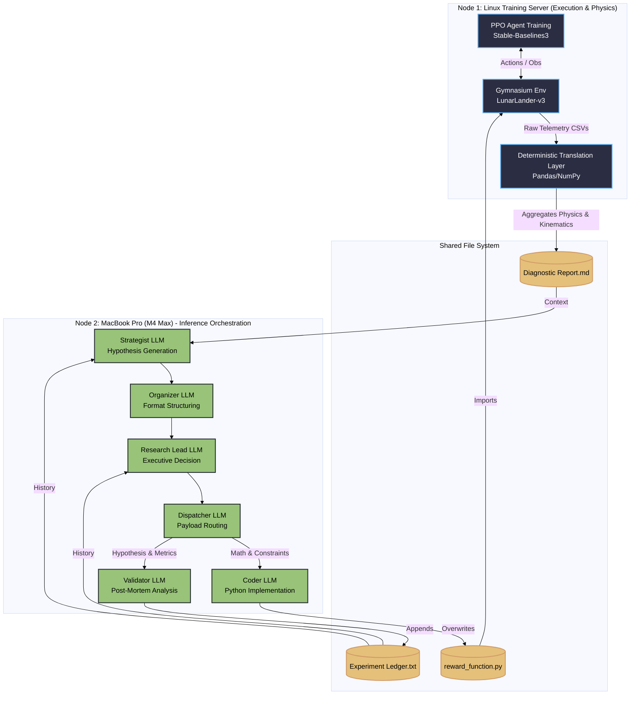
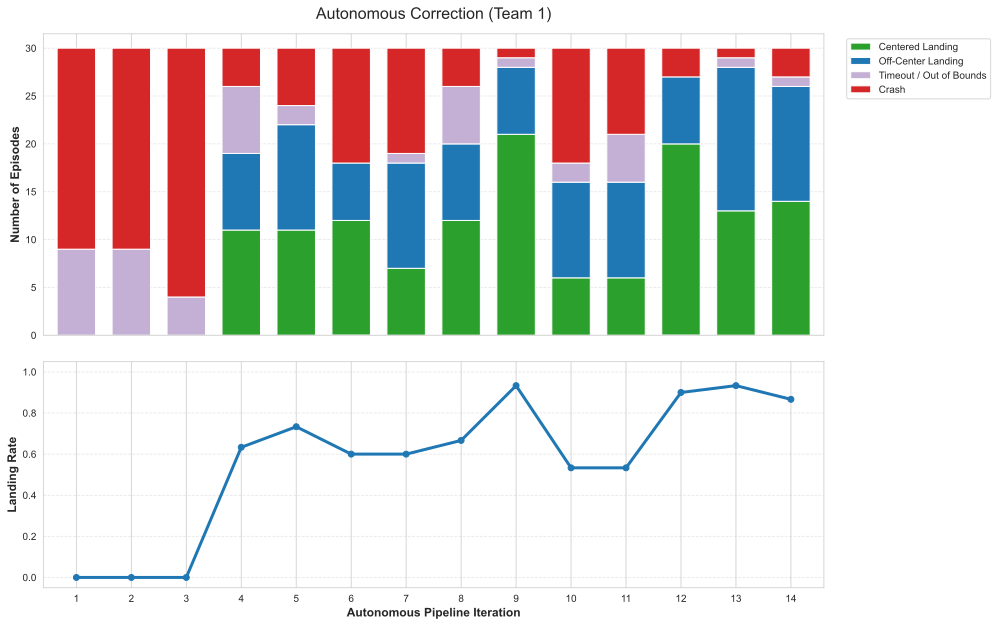

# Autonomous Algorithmic Reward Design (ARD) via Multi-Agent Orchestration

**This project demonstrates a closed-loop system that autonomously improves reinforcement learning reward functions.
Starting from deliberately flawed objectives that produce unstable behavior, the system iteratively diagnoses failure modes and converges toward stable, successful control policies.**

## Core Insight

The system does not directly modify the trained policy.  
Instead, it improves the *reward function* that defines the task.

By iteratively analyzing behavior and refining incentives, the system transforms unstable or misaligned objectives into ones that reliably produce successful outcomes.

Under the hood, a closed-loop pipeline translates raw training telemetry into a structure diagnostic report, which a multi-agent LLM system uses to iteratively write, test, and debug reward functions.

**High-level System Overview**


## Executive Summary

* Reinforcement Learning (RL) agents are notorious for exploiting poorly designed reward functions. During the development of a LunarLander-v3 agent, I encountered a fundamental problem: tracking a single "Total Reward" line graph doesn't explain *why* an agent fails. The agent might plummet into the ground, hover until it runs out of time, or land perfectly but slide off the pad—all of which might yield the exact same numerical penalty.
* To solve this, I built a locally-hosted, Multi-Agent LLM pipeline that automates Algorithmic Reward Design (ARD). Instead of relying on human intuition to manually tweak penalty coefficients, this system translates continuous-control physics into deterministic statistics. It uses a 6-stage "Chain-of-Agents" architecture to evaluate physical telemetry, generate novel mathematical reward functions, write the Python code, train a PPO agent, and scientifically validate the outcome—completely unsupervised.

## Technical Highlights

* **The Deterministic Translation Layer:** 
LLMs hallucinate when fed raw neural network weights or unstructured logs. To solve this, a Python layer intercepts the PPO telemetry and translates it into pure, objective statistics (e.g., Critic Saturation Index, Actuator Chatter Rates). It converts an opaque RL environment into a structured tabular data problem.

* **Decoupled Agentic Workflow:**
To prevent context-window saturation and syntax collapse, reasoning is strictly isolated from execution. The system uses a 6-stage routing protocol where specialized agents (Strategist, Research Lead, Coder, Validator) are restricted to single, distinct objectives.

* **Algorithmic Credit Assignment:**
The system actively computes Pearson correlations ($\rho$) between individual reward components and dynamic physical proxies (like Euclidean speed or spatial proximity). This allows the LLM to mathematically identify which parts of its generated code are helping, and which are actively causing crashes.

* **Local Orchestration:**
Designed to run completely unsupervised on local hardware. The pipeline utilizes distributed compute (a Linux server handling PPO training, and a MacBook Pro M4 Max handling LLM inference) to dynamically rewrite physics, train, and validate using a highly-quantized 8B reasoning model in under 8 minutes per iteration.


## System Architecture: The Decoupled Loop

Passing raw RL telemetry into an LLM's context window leads to immediate hallucination. To prevent this, the pipeline is strictly decoupled into two domains: **Execution & Translation** (Linux Compute Node) and **Meta-Reasoning** (MacBook Pro + Local LLMs).

**Phase 1: Deterministic Translation (The Physics Engine)**

Before the LLM sees any data, a Python layer intercepts the PPO training logs and translates them into semantic physical states. It dynamically computes Pearson correlations ($\rho$) between individual reward terms and physical proxies (like Euclidean speed or spatial proximity). This converts an opaque RL black-box into a clear tabular data problem.

**Phase 2: Multi-Agent Meta-Reasoning (The Brain)**

To prevent syntax collapse, reasoning is isolated from execution using 6 highly restricted agents:
1. **Strategist:** Reads the translated physics report and generates 3 distinct mathematical hypotheses.
2. **Organizer:** A strict parser that sanitizes the Strategist's output into a pristine Markdown schema.
3. **Research Lead:** The executive filter that applies Occam's Razor and selects the best equation.
4. **Dispatcher:** Routes the decision, splitting the raw math from the scientific hypothesis.
5. **Coder:** Operates in a strict syntax-only sandbox to inject the Python logic into the Gymnasium wrapper.
6. **Validator:** Evaluates the *next* iteration's diagnostic report against the original hypothesis, specifically hunting for reward hacking, and compresses the failure into an immutable lesson.

**Detailed Data Flow**

## What Makes This Approach Different

- **Closed-loop reward optimization** instead of manual tuning  
- **Structured diagnostics** replacing opaque reward curves  
- **Role-specialized LLM system (mixture-of-agents)** for reasoning, coding, and validation  
- **Behavior-first analysis** using semantic terminal states (e.g., crash, stable landing)  

## The Methodology: Translating Physics to Context

The core problem this project solves is simple: standard Reinforcement Learning telemetry isn't descriptive enough for an LLM to act on. If an agent gets a low score, the LLM doesn't know if it plummeted into the ground, hovered until it ran out of time, or landed perfectly but slid off the pad.

To give the LLM the context it needs to rewrite the reward function, this system relies on a **Deterministic Translation Layer**.

* **Semantic Tagging:** The Gymnasium environment wrapper tracks the physical state at the terminal step and tags the episode (e.g., `crashed`, `hover_timeout`, `landed_but_slid_into_valley`).
* **Dynamic Proxy Metrics:** If the agent fails to land across all seeds, the translation layer dynamically shifts its correlation target. It calculates the Pearson correlation ($\rho$) between individual reward components and physical proxies like *Kinematic Stability* (Euclidean norm of velocities) or *Spatial Proximity* to the pad.
* **Algorithmic Credit Assignment:** This allows the LLM to "see" exactly which term in its mathematical equation is helping the agent descend safely, and which term is inadvertently causing a crash.

## Failure → Recovery Case Study


To evaluate the system, experiments were initialized with deliberately flawed reward functions designed to induce specific failure behaviors:

- Spinning and crashing  
- Aggressive lateral oscillation  
- Other unstable control patterns  

Across iterations, the system:

1. Diagnoses behavioral failure modes from structured telemetry  
2. Identifies misaligned reward components  
3. Proposes and implements refined reward functions  
4. Retrains and reevaluates the policy  

Result:  
The system consistently transforms unstable behaviors into controlled, task-aligned policies over successive iterations.

## Project Structure & Dynamic Workspaces

To handle continuous iteration loops and separate LLM inference from PPO training, the project relies on a `workspace_manager.py` that dynamically generates mirrored file systems for every experiment run.

```text
├── controllers/          # Main loop orchestration and bash scripts (inner_loop.sh, outer_loop.sh)
├── experiments/          # Dynamically generated by Workspace Manager
│   └── [Campaign_Tag]/
│       └── [Model_Name]/ # (e.g., deepseek-r1-8b)
│           ├── cognition/       # LLM reasoning traces, JSON payloads, and the Experiment Ledger
│           ├── generated_code/  # The Python reward functions written by the Coder agent
│           └── telemetry/       # Raw CSVs and metric payloads passed between Mac and Linux
├── prompts/              # System prompt templates for the multi-agent architecture
├── src/                  # Core Python modules (evaluation, callbacks, wrappers, ledger)
├── train.py              # PPO execution script
└── requirements.txt      
```

## Future Work (Phase 2)

The next phase of this project will extend the reward decomposition concept to utilize traditional machine learning for algorithmic credit assignment.
Instead of relying on the LLM to guess scalar coefficients, the LLM will generate purely structural reward proposals. We will then use **Optuna** to tune the coefficients across parallel mini-runs. Finally, by training an **XGBoost** model on the resulting tabular telemetry, we will compute **SHAP values** to determine the exact, non-linear feature importance of each mathematical reward component.

## Installation & Quick Start

This pipeline requires a dual-node setup (or a single machine running both the LLM inference and the RL environment).

**1. Install Dependencies**

```bash
git clone https://github.com/Cheerful-Nebula/rl_agent_loop.git
cd rl_agent_loop
pip install -r requirements.txt

```

**2. Local LLM Setup**
Ensure you have [Ollama](https://ollama.ai/) installed and the reasoning model pulled:

```bash
ollama pull deepseek-r1:8b

```

**3. Execute the Pipeline**

* Start the orchestration loop using the `outer_loop.sh` script.
* Followed by desired number of iterations (integer), then the number of timesteps each PPO agent will be trained on the newly generated reward function (integer).
* Using the word `remote` triggers a distributed compute cycle, don't include `remote` to have entire loop run on a single computer.
* The Workspace Manager will automatically generate your experiment directories.

```bash
./outer_loop.sh 10 1000000 remote

```
