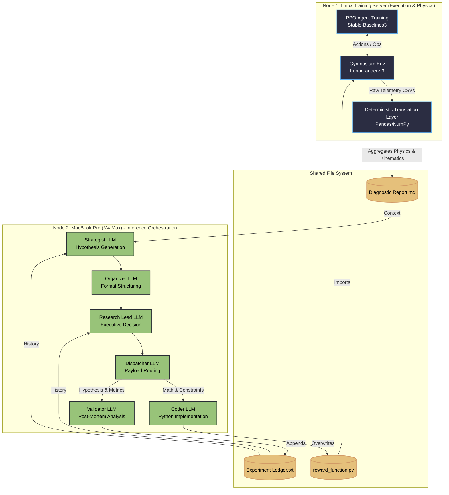

# Autonomous Algorithmic Reward Design (ARD) via Multi-Agent Orchestration

**A locally-hosted, closed-loop pipeline that translates continuous-control physics into deterministic statistics to autonomously write, train, and debug Reinforcement Learning reward functions.**

## Executive Summary

Reinforcement Learning (RL) is notorious for its brittleness. Reward shaping is traditionally a manual "dark art" where a slight miscalculation in a penalty coefficient causes an agent to exploit the environment—like hovering indefinitely to farm survival points instead of landing.

This project completely automates the Algorithmic Reward Design (ARD) cycle. It replaces human intuition with a 6-stage Multi-Agent LLM architecture that evaluates physical telemetry, generates novel mathematical reward functions, writes the Python code, trains a PPO agent, and scientifically validates the outcome.

**Key Innovations:**

* **The Deterministic Translation Layer:** Instead of feeding raw neural network weights, this pipeline translates PPO rollout telemetry into **objective statistics** (e.g., Critic Saturation Index). It converts an RL black-box into an interpretable tabular problem.

* **Isolated "Chain-of-Agents" Architecture:** Reasoning is strictly decoupled from execution to prevent hallucination. A **Strategist** generates hypotheses, while a **Coder** injects logic directly into the Gymnasium environment wrapper.

* **Algorithmic Credit Assignment:** The system computes **Pearson correlations** between reward components and task success. A Validator agent identifies "Traitor Components" to prevent cyclic reward hacking.

* **High-Efficiency Local Execution:** Designed to run unsupervised on local hardware. A single 8B-parameter model rewrites physics and trains the agent in **under 8 minutes per iteration**.

