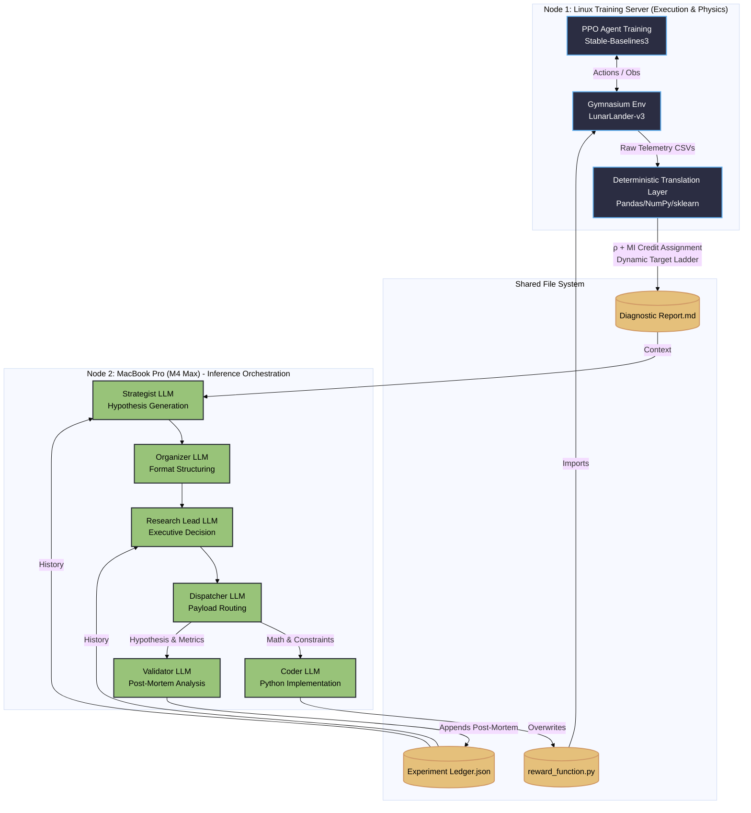
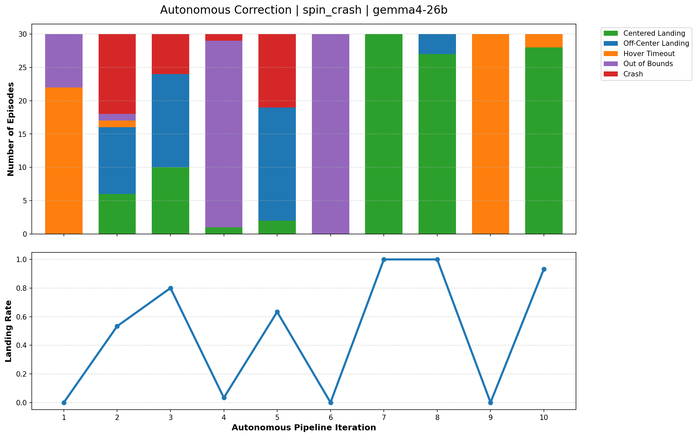

# Autonomous Algorithmic Reward Design (ARD) via Multi-Agent Orchestration

**This project demonstrates a closed-loop system that autonomously improves reinforcement learning reward functions.
Starting from deliberately flawed objectives that produce unstable behavior, the system iteratively diagnoses failure modes and converges toward stable, successful control policies.**

## Core Insight

The system does not directly modify the trained policy.  
Instead, it improves the *reward function* that defines the task.

By iteratively analyzing behavior and refining incentives, the system transforms unstable or misaligned objectives into ones that reliably produce successful outcomes.

Under the hood, a closed-loop pipeline translates raw training telemetry into a structured diagnostic report, which a multi-agent LLM system uses to iteratively write, test, and debug reward functions.

**High-level System Overview**


## Executive Summary

* Reinforcement Learning (RL) agents are notorious for exploiting poorly designed reward functions. During the development of a LunarLander-v3 agent, I encountered a fundamental problem: tracking a single "Total Reward" line graph doesn't explain *why* an agent fails. The agent might plummet into the ground, hover until it runs out of time, or land perfectly but slide off the pad—all of which might yield the exact same numerical penalty.
* To solve this, I built a locally-hosted, Multi-Agent LLM pipeline that automates Algorithmic Reward Design (ARD). Instead of relying on human intuition to manually tweak penalty coefficients, this system translates continuous-control physics into deterministic statistics. It uses a 6-stage "Chain-of-Agents" architecture to evaluate physical telemetry, generate novel mathematical reward functions, write the Python code, train a PPO agent, and scientifically validate the outcome—completely unsupervised.

## Technical Highlights

* **The Deterministic Translation Layer:**
LLMs hallucinate when fed raw neural network weights or unstructured logs. To solve this, a Python layer intercepts the PPO telemetry and translates it into pure, objective statistics (e.g., Critic Saturation Index, Actuator Chatter Rates, Trajectory Isomorphism). It converts an opaque RL environment into a structured tabular data problem that an LLM can reason about without distortion.

* **Dual-Channel Algorithmic Credit Assignment (ρ + MI):**
The system goes beyond simple reward curves by computing both Pearson correlation ($\rho$) and Mutual Information (MI) between individual reward components and task outcomes. Pearson captures linear alignment; MI surfaces non-linear dependencies—threshold bonuses, quadratic attractors, and saturating terms—that $\rho$ is mathematically blind to. This dual-channel approach produces four diagnostic flags: 🟢 Optimal, 🔴 Negatively Aligned ($\rho < -0.2$), 🟣 Hidden Dependency (low $|\rho|$ but non-trivial MI), and 🟡 Low Magnitude (dead weight with confirmed low MI).

* **Dynamic Target Metric Ladder:**
The translation layer dynamically selects its correlation target based on the agent's current success rate — because at 0% success, binary task success is an uninformative signal with no variance to correlate against. This system implements a three-rung fallback: **Task Success** (when the agent is landing some of the time) → **Impact Softness** (when the agent lands consistently but crashes hard) → **Composite Viability** (at 0% success, a failure-mode-weighted composite of spatial proximity, kinematic stability, and attitude control, with weights dynamically assigned based on the dominant failure: `out_of_bounds`, `crashed`, `hover_timeout`, or `landed_but_slid_into_valley`).

* **Decoupled Agentic Workflow:**
To prevent context-window saturation and syntax collapse, reasoning is strictly isolated from execution. The system uses a 6-stage routing protocol where specialized agents (Strategist, Organizer, Research Lead, Dispatcher, Coder, Validator) are each restricted to a single, distinct objective with independently tuned temperature and context window parameters.

* **Closed-Loop Read/Write/Delete Architecture:**
The pipeline is a true autonomous loop. On each iteration, the Validator reads the prior hypothesis from the Experiment Ledger, the new diagnostic report is written to the shared filesystem, the Coder overwrites the reward function, and the prior iteration's intermediate artifacts are pruned. No human intervention is required between iterations.

* **Local Orchestration:**
Designed to run completely unsupervised on local hardware. The pipeline utilizes distributed compute (a Linux server handling PPO training, and a MacBook Pro M4 Max handling LLM inference) with quantized local models ranging from 8B to 30B parameters, the practical upper bound on consumer hardware, to dynamically rewrite physics, train, and validate with no human intervention required between iterations.


## System Architecture: The Decoupled Loop

Passing raw RL telemetry into an LLM's context window leads to immediate hallucination. To prevent this, the pipeline is strictly decoupled into two domains: **Execution & Translation** (Linux Compute Node) and **Meta-Reasoning** (MacBook Pro + Local LLMs).

**Phase 1: Deterministic Translation (The Physics Engine)**

Before the LLM sees any data, a Python layer intercepts the PPO training logs and translates them into semantic physical states. It dynamically computes Pearson correlations ($\rho$) and Mutual Information (MI) between individual reward terms and physical proxies (like Euclidean speed, spatial proximity, or impact softness), using a dynamic target ladder that adapts to the agent's current success rate. This converts an opaque RL black-box into a clear, interpretable diagnostic problem.

**Phase 2: Multi-Agent Meta-Reasoning (The Brain)**

To prevent syntax collapse, reasoning is isolated from execution using 6 highly restricted agents:
1. **Strategist:** Reads the translated diagnostic report and generates 3 distinct mathematical hypotheses, guided by both $\rho$ and MI signals to distinguish negatively aligned components from non-linear hidden dependencies.
2. **Organizer:** A strict parser that sanitizes the Strategist's output into a pristine Markdown schema ("Mathematical Contract") with zero data loss.
3. **Research Lead:** The executive filter that cross-references proposals against the full Experiment Ledger to avoid cyclical failures and selects the single best hypothesis.
4. **Dispatcher:** Routes the decision, splitting the raw mathematical formulation from the scientific hypothesis into separate payloads.
5. **Coder:** Operates in a strict syntax-only sandbox to translate the math spec into a `calculate_reward(obs, info)` Python function, which is then validated by a deterministic AST compiler before deployment.
6. **Validator:** Evaluates the *next* iteration's diagnostic report against the original hypothesis, specifically hunting for Goodhart's Law (reward hacking), and compresses the outcome into an immutable post-mortem appended to the Experiment Ledger.

**Detailed Data Flow**

## What Makes This Approach Different

- **Closed-loop read/write/delete reward optimization** instead of manual tuning
- **Structured deterministic diagnostics** replacing opaque reward curves
- **Dual-channel credit assignment** using both Pearson ρ and Mutual Information to distinguish linear misalignment from non-linear hidden dependencies
- **Dynamic target metric ladder** that adapts correlation targets to the agent's current failure regime
- **Role-specialized LLM system (mixture-of-agents)** for reasoning, coding, and validation, with per-agent temperature and context window tuning
- **Behavior-first analysis** using semantic terminal states (e.g., `crashed`, `hover_timeout`, `landed_but_slid_into_valley`, `landed_centered`)

## The Methodology: Translating Physics to Context

The core problem this project solves is simple: standard Reinforcement Learning telemetry isn't descriptive enough for an LLM to act on. If an agent gets a low score, the LLM doesn't know if it plummeted into the ground, hovered until it ran out of time, or landed perfectly but slid off the pad.

To give the LLM the context it needs to rewrite the reward function, this system relies on a **Deterministic Translation Layer** with dual-channel component analysis.

* **Semantic Tagging:** The Gymnasium environment wrapper tracks the physical state at the terminal step and tags the episode (e.g., `crashed`, `hover_timeout`, `landed_but_slid_into_valley`, `landed_centered`).

* **Dynamic Proxy Ladder:** The translation layer dynamically selects its correlation target based on the agent's current success rate. At 0% success, it shifts to a composite physical viability score weighted by the dominant failure mode. At 100% success, it shifts to impact softness. Only when the agent is partially succeeding does it correlate against binary task success, when that signal is actually discriminating.

* **Dual-Channel Credit Assignment:** For each LLM-generated reward component, the system computes:
  - **Pearson ρ** against the active target metric — captures the linear, signed direction of alignment.
  - **Mutual Information (MI)** against binary task success, captures any statistical dependence, including non-linear ones. A component with low |ρ| but high MI is flagged as a 🟣 **Hidden Dependency**: it has real influence on outcomes that linear correlation cannot see (e.g., a threshold bonus, a quadratic attractor, or a saturating `tanh` term). The dead-weight flag (🟡) requires *both* low magnitude *and* low MI, preventing misclassification of small-coefficient gating terms as inert.

## Failure → Recovery Case Study


To evaluate the system, experiments were initialized with deliberately flawed reward functions designed to induce specific failure behaviors:

- Spinning and crashing  
- Aggressive lateral oscillation  
- Other unstable control patterns  

Across iterations, the system:

1. Diagnoses behavioral failure modes from structured telemetry  
2. Identifies misaligned and non-linearly acting reward components  
3. Proposes and implements refined reward functions  
4. Retrains and reevaluates the policy  

Result:  
The system consistently transforms unstable behaviors into controlled, task-aligned policies over successive iterations.

## Project Structure & Dynamic Workspaces

To handle continuous iteration loops and separate LLM inference from PPO training, the project relies on a `workspace_manager.py` that dynamically generates mirrored file systems for every experiment run.

```text
├── controllers/          # LLM orchestration scripts
├── experiments/          # Dynamically generated by Workspace Manager
│   └── [Campaign_Tag]/
│       └── [Model_Name]/ # (e.g., deepseek-r1-8b)
│           ├── cognition/       # LLM reasoning traces, JSON payloads, and the Experiment Ledger
│           ├── generated_code/  # The Python reward functions written by the Coder agent
│           └── telemetry/       # Raw CSVs and metric payloads passed between Mac and Linux
├── prompts/              # System prompt templates for the multi-agent architecture
├── src/                  # Core Python modules (evaluation, callbacks, wrappers, ledger)
├── train.py              # PPO execution script
├── outer_loop.sh         # Main orchestration bash script 1
├── inner_loop.sh         # Main orchestration bash script 2
└── requirements.txt      
```

## Future Work (Phase 2)

The next phase extends algorithmic credit assignment beyond statistical correlation. Rather than having the LLM guess scalar coefficients, it will generate purely structural reward proposals. **Optuna** will then tune the coefficients across parallel mini-runs. An **XGBoost** model trained on the resulting tabular telemetry will compute **SHAP values** to determine exact, non-linear feature importance for each reward component—completing the transition from statistical diagnostics to causal attribution.

## Installation & Quick Start

This pipeline requires a dual-node setup (or a single machine running both the LLM inference and the RL environment).

**1. Install Dependencies**

```bash
git clone https://github.com/dominik-klingshirn/rl_agent_loop.git
cd rl_agent_loop
pip install -r requirements.txt
```

**2. Local LLM Setup**
Ensure you have [Ollama](https://ollama.ai/) installed and the reasoning model pulled:

```bash
ollama pull deepseek-r1:32b
```
Note on model selection: A single model assigned to every role underperforms significantly compared to role-matched selection. Empirically, having role-specific model choices can substantially better reward proposals than any single model used uniformly. See config.py for per-role temperature and context window settings. 

The model 'team' used for the Case Study plot above was following:
Strategist    : `gemma3:27b`
Organizer     : `deepseek-r1:32b`
Research Lead : `deepseek-r1:32b`
Dispatcher    : `deepseek-r1:32b`
Coder         : `qwen3-coder:30b`
Validator     : `deepseek-r1:32``b`

**3. Execute the Pipeline**

* Start the orchestration loop using the `outer_loop.sh` script.
* The Workspace Manager will automatically generate your experiment directories.
* -i : flag for desired number of iterations (integer)
* -s : flag for the number of timesteps each PPO agent will be trained on the newly generated reward function (integer)
* -t : flag for optional tag appended to campaign's filename 
    * Using the word `remote` triggers a distributed compute cycle; omit it to run the entire loop on a single machine.

```bash
./outer_loop.sh -i 10 -s 1000000 -t remote
```
