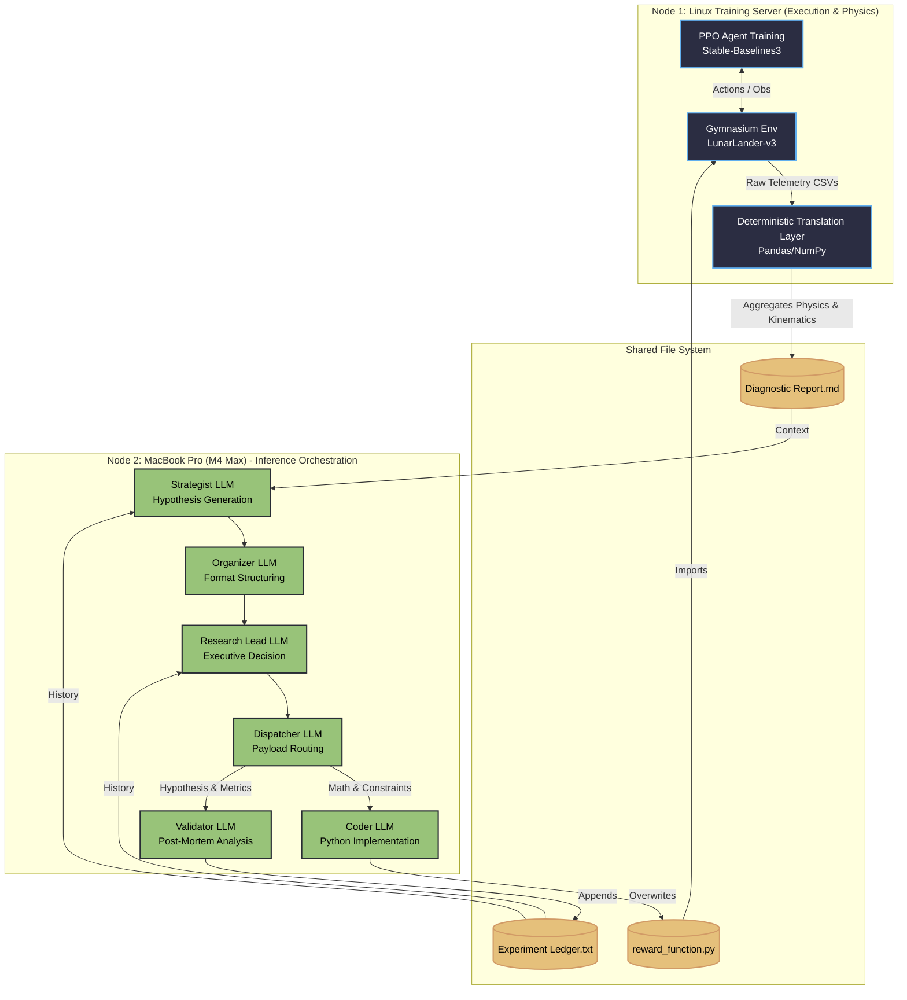

# Autonomous Algorithmic Reward Design (ARD) via Multi-Agent Orchestration

**A locally-hosted, closed-loop pipeline that translates continuous-control physics into deterministic statistics to autonomously write, train, and debug Reinforcement Learning reward functions.**

## Executive Summary

Reinforcement Learning (RL) is notorious for its brittleness. Reward shaping is traditionally a manual "dark art" where a slight miscalculation in a penalty coefficient causes an agent to exploit the environment—like hovering indefinitely to farm survival points instead of landing.

This project completely automates the Algorithmic Reward Design (ARD) cycle. It replaces human intuition with a 6-stage Multi-Agent LLM architecture that evaluates physical telemetry, generates novel mathematical reward functions, writes the Python code, trains a PPO agent, and scientifically validates the outcome.

**Key Innovations:**

* **The Deterministic Translation Layer:** Instead of feeding raw neural network weights or vague visual descriptions to an LLM, this pipeline translates raw PPO rollout telemetry into pure, objective statistics (e.g., Critic Saturation Index, Trajectory Isomorphism, Actuator Chatter Rates). It converts an RL black-box problem into an interpretable tabular data problem.
 
* **Isolated "Chain-of-Agents" Architecture:** To prevent LLM hallucination and syntax collapse, reasoning is strictly decoupled from execution. A creative "Strategist" generates the mathematical hypotheses, an executive "Research Lead" filters them via Occam's Razor, and a rigid "Coder" injects the precise Python logic directly into the Gymnasium environment wrapper.
 
* **Algorithmic Credit Assignment & Goodhart’s Law Detection:** The system actively computes Pearson correlations ($\rho$) between individual reward components and semantic task success. A dedicated "Validator" agent identifies "Traitor Components" that invert their intended effect, compressing failed policies into an immutable Experiment Ledger to prevent cyclic reward hacking.
 
* **High-Efficiency Local Execution:** Designed to run completely unsupervised on local hardware. Utilizing distributed compute (Linux server for PPO training, MacBook Pro for model inference), a single 8B-parameter reasoning model dynamically rewrites environment physics, trains the agent, and runs post-mortem validation in under 8 minutes per iteration.

