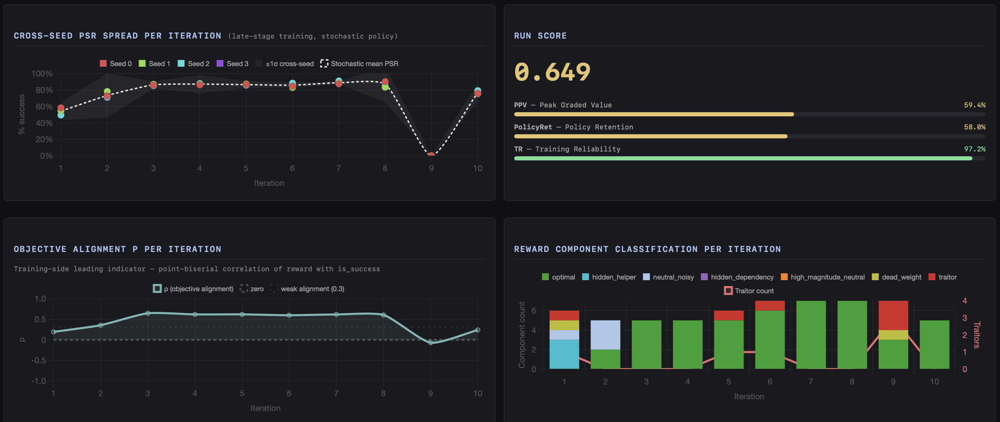
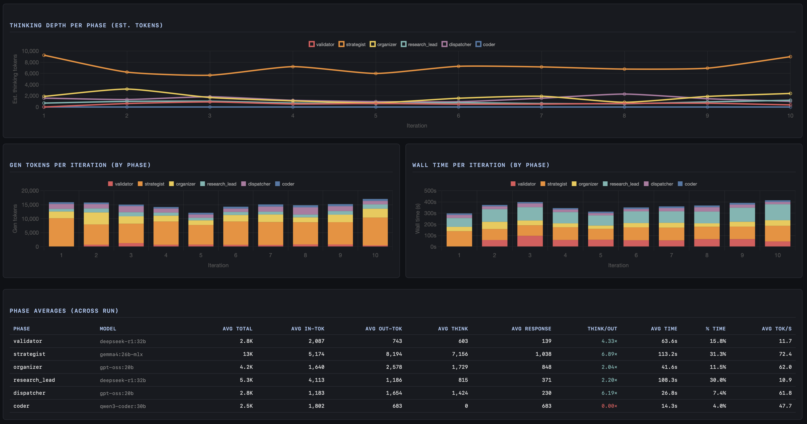
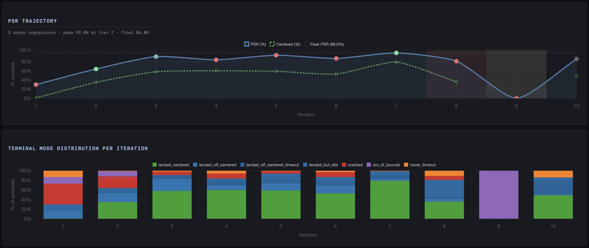

# Autonomous Reward Design (ARD) via Multi-Agent Orchestration

**This project demonstrates a closed-loop system that runs an autonomous search over reinforcement learning reward functions. Starting from deliberately flawed objectives that produce unstable behavior, the system iteratively diagnoses failure modes and rewrites the reward until it reliably produces stable, successful control policies.**

**Representative run (`2026-06-14_sideways_slide_10cycles_1MSteps_remote_baselineV1_organizerDelFieldCorrection_run3`, fully fingerprinted — see Evaluation & Reproducibility):**
The system inherited a deliberately broken reward that paid out a healthy mean reward (~110) while the lander crashed in 99.9% of episodes — **0% landing success**, with **5 of its 9 reward components negatively aligned** with successful landing. Run as a **search over reward functions** — not a one-shot fix — over **10** self-directed iterations, with **zero human edits to the reward function**, ended with **86% landing success**, every component positively aligned. RunScore: **0.649**.

## Demo

> Autonomous walkthrough: the pipeline diagnoses a deliberately broken reward and rewrites it
> into a stable landing policy, with no human edits to the reward function.

https://github.com/user-attachments/assets/4da3a6f8-9826-429e-bd6e-a11183b3de16

## Core Insight

The system does not directly modify the trained policy. Instead, it improves the *reward function* that defines the task.

By iteratively analyzing behavior and refining incentives, the system transforms unstable or misaligned objectives into ones that reliably produce successful outcomes.

Under the hood, a closed-loop pipeline translates raw training telemetry into a structured diagnostic report, which a multi-agent LLM system uses to iteratively write, test, and debug reward functions.

**High-level System Overview**


## Executive Summary

* Reinforcement Learning (RL) agents are notorious for exploiting poorly designed reward functions. During the development of a LunarLander-v3 agent, I encountered a fundamental problem: tracking a single "Total Reward" line graph doesn't explain *why* an agent fails. The agent might plummet into the ground, hover until it runs out of time, or land perfectly but slide off the pad—all of which might yield the exact same numerical penalty.
* To solve this, I built a **locally-hosted, Multi-Agent LLM** pipeline that automates Algorithmic Reward Design. Instead of relying on human intuition to manually tweak penalty coefficients, this system translates continuous-control physics into deterministic statistics. It uses a 6-stage "Chain-of-Agents" architecture to evaluate physical telemetry, generate novel mathematical reward functions, write the Python code, train a PPO agent, and assess/validate the reward function intervention against the outcome—completely unsupervised.

## Technical Highlights

* **The Deterministic Translation Layer:**
LLMs hallucinate when fed raw neural network weights or unstructured logs. To solve this, a Python layer intercepts the PPO telemetry and translates it into pure, objective statistics.
It converts an opaque RL environment into a structured tabular data problem that an LLM can reason about without distortion.

* **Dual-Channel Algorithmic Credit Assignment (ρ + MI):**
The system goes beyond simple reward curves by computing both Pearson correlation ($\rho$) and Mutual Information (MI) between individual reward components and task outcomes. Pearson captures linear alignment; MI surfaces non-linear dependencies—threshold bonuses, quadratic attractors, and saturating terms—that $\rho$ is mathematically blind to. This dual-channel approach produces four diagnostic flags: 🟢 Optimal, 🔴 Negatively Aligned ($\rho < -0.2$), 🟣 Hidden Dependency (low $|\rho|$ but non-trivial MI), and 🟡 Low Magnitude (dead weight with confirmed low MI).

* **Dynamic Target Metric Ladder:**
The translation layer dynamically selects its correlation target based on the agent's current success rate — because at 0% success, binary task success is an uninformative signal with no variance to correlate against. This system implements a three-rung fallback: **Task Success** (when the agent is landing some of the time) → **Impact Softness** (when the agent lands consistently but crashes hard) → **Composite Viability** (at 0% success, a failure-mode-weighted composite of spatial proximity, kinematic stability, and attitude control, with weights dynamically assigned based on the dominant failure: `out_of_bounds`, `crashed`, or `hover_timeout`).

* **Decoupled Agentic Workflow:**
To prevent context-window saturation and syntax collapse, reasoning is strictly isolated from execution. The system uses a 6-stage routing protocol where specialized agents (Strategist, Organizer, Research Lead, Dispatcher, Coder, Validator) are each restricted to a single, distinct objective with independently tuned temperature and context window parameters.

* **Closed-Loop Read/Write/Delete Architecture:**
The pipeline is a true autonomous loop. On each iteration, the Validator reads the prior hypothesis from the Experiment Ledger, the new diagnostic report is written to the shared filesystem, the Coder overwrites the reward function, and the prior iteration's intermediate artifacts are pruned. No human intervention is required between iterations.

* **Local Orchestration:**
Designed to run completely unsupervised on local hardware. The pipeline utilizes distributed compute (a Linux server handling PPO training, and a MacBook Pro M4 Max handling LLM inference) with quantized local models ranging from 8B to 30B parameters, the practical upper bound on consumer hardware, to dynamically rewrite physics, train, and validate with no human intervention required between iterations.


## System Architecture: The Decoupled Loop

Passing raw RL telemetry into an LLM's context window leads to immediate hallucination. To prevent this, the pipeline is strictly decoupled into two domains: **Execution & Translation** (Linux Compute Node) and **Meta-Reasoning** (MacBook Pro + Local LLMs).

**Phase 1: Deterministic Translation (The Physics Engine)**

Before the LLM sees any data, a Python layer intercepts the PPO training logs and translates them into semantic physical states. It dynamically computes Pearson correlations ($\rho$) and Mutual Information (MI) between individual reward terms and physical proxies (like Euclidean speed, spatial proximity, or impact softness), using a dynamic target ladder that adapts to the agent's current success rate. This converts an opaque RL black-box into a clear, interpretable diagnostic problem.

**Phase 2: Multi-Agent Meta-Reasoning (The Brain)**

To prevent syntax collapse, reasoning is isolated from execution using 6 highly restricted agents:
1. **Strategist:** Reads the previous `.py` file, ledger of previous function intervetions ("Experiment Ledger") and diagnostic report. Guided by both $\rho$ and MI signals to distinguish negatively aligned components from non-linear hidden dependencies,to generate 3 distinct mathematical interventions proposals accompanied with falsifiable expected outcome.
2. **Organizer:** A strict parser that sanitizes the Strategist's output, with zero data loss, into a pristine Markdown schema ("Mathematical Contract").
3. **Research Lead:** The executive filter that cross-references proposals with current Diagnostic Report against the full Experiment Ledger to avoid cyclical failures and selects the single most appropriate proposal to proceed with.
4. **Dispatcher:** Routes the decision, splitting the raw mathematical formulation from the falsifiable expected outcome into separate payloads.
5. **Coder:** Operates in a strict syntax-only sandbox to translate the math spec into a `calculate_reward(obs, info)` Python function, which is then validated by a deterministic AST compiler before deployment.
6. **Validator:** Evaluates the *next* iteration's diagnostic report against the original intervention proposal, specifically hunting for Goodhart's Law (reward hacking), and compresses the outcome into an immutable post-mortem appended to the Experiment Ledger.

**Detailed Data Flow**

```mermaid
flowchart LR

  %% =========================
  %% Node 1: Execution Node
  %% =========================
  subgraph N1["Node 1 – Execution Node (Linux)"]
    RPY[(iterNN_reward.py)]
    PPO["PPO training\nLunarLander-v3"]
    CSV["Raw telemetry\nCSVs"]
    METRICS[(iterNN_metric_payload.json)]

    RPY --> PPO --> CSV --> METRICS
  end

  %% =========================
  %% Node 2: Cognition Node
  %% =========================
  subgraph N2["Node 2 – Cognition Node (Mac – multi-agent LLM)"]
    TRANS["Deterministic translation\nanalysis.py"]
    DIAG[(Diagnostic Report)]

    subgraph AGENTS["Multi-agent\nmeta-reasoning"]
      VAL["Validator\npost-mortem"]
      STRAT["Strategist\ntopology proposals"]
      ORG["Organizer\nformat structuring"]
      LEAD["Research Lead\nhypothesis selection"]
      DISP["Dispatcher\npayload routing"]
      CODER["Coder\nPython implementation"]

      %% Diagnostic Report fan-out
      DIAG --> VAL
      DIAG --> STRAT
      DIAG --> LEAD

      %% Proposal refinement & decision
      STRAT --> ORG --> LEAD

      %% Dispatch to coder and ledger
      LEAD --> DISP --> CODER
    end

    CODEVAL["CodeValidator\nstatic + boundary tests"]
    LEDGER[(Experiment Ledger.json)]
    WS["Workspace Manager\ncampaign directories"]

    %% State management
    VAL --> LEDGER
    DISP --> LEDGER
    LEDGER --> STRAT
    LEDGER --> LEAD

    WS --- LEDGER
  end

  %% =========================
  %% Cross-node data flow
  %% =========================
  METRICS -->|"SCP metric payload"| TRANS --> DIAG
  CODER --> CODEVAL
  CODEVAL -->|"ships new reward.py"| RPY

  %% =========================
  %% STYLES
  %% =========================

  %% Node grouping styles
  classDef execNode fill:#e0f2fe,stroke:#0369a1,color:#0f172a,stroke-width:1px;
  classDef execPipeline fill:#dbeafe,stroke:#1d4ed8,color:#0f172a,stroke-width:1px;

  classDef cogNode fill:#f5f3ff,stroke:#7c3aed,color:#111827,stroke-width:1px;
  classDef translation fill:#fef9c3,stroke:#d97706,color:#111827,stroke-width:1px;
  classDef agents fill:#ecfdf3,stroke:#16a34a,color:#052e16,stroke-width:1px;
  classDef validation fill:#f3e8ff,stroke:#7e22ce,color:#111827,stroke-width:1px;
  classDef container fill:#f9fafb,stroke:#4b5563,color:#111827,stroke-width:1px,stroke-dasharray:3 3;

  %% Artifact styles
  classDef artifactIter fill:#fee2e2,stroke:#b91c1c,color:#111827,stroke-width:1px;
  classDef artifactMemory fill:#fecdd3,stroke:#7f1d1d,color:#111827,stroke-width:2px;

  %% Apply classes
  class N1 execNode;
  class PPO,CSV execPipeline;

  class N2 cogNode;
  class TRANS translation;
  class AGENTS,VAL,STRAT,ORG,LEAD,DISP,CODER agents;
  class CODEVAL validation;
  class WS container;

  %% artifacts
  class RPY,METRICS,DIAG artifactIter;
  class LEDGER artifactMemory;
```

## Evaluation & Reproducibility

A reward-design *search algorithm* is only as credible as the rigor used to measure it.
This project treats its own evaluation as a first-class engineering surface.

### Tier 1 — RunScore (active)

A single run produces noisy, multi-objective telemetry. RunScore collapses a full run into one comparable scalar in `[0, 1]`, computed post-hoc from per-iteration metric payloads (`post_hoc_analysis/compute_run_score.py`):

$$
\mathrm{RunScore} \;=\; \mathrm{PPV}^{\,0.4}\cdot \mathrm{PolRet}^{\,0.4}\cdot \mathrm{TR}^{\,0.2}
$$

A weighted **geometric mean** of three independent components, each in $[0, 1]$ — a collapse in any one term drags the whole score down, so no dimension can mask a failure in another.

$$
\mathrm{PPV} \;=\; \max_{i}\Big[\, \mathrm{GS}_i \cdot \max\big(0,\; 1 - \lambda_2\,\mathrm{chatter}_i\big) \Big]
$$

$$
\mathrm{PolRet} \;=\; \frac{1}{N-1}\sum_{i=1}^{N-1} \frac{\mathrm{GS}_i + \mathrm{GS}_{i+1}}{2}
$$

$$
\mathrm{TR} \;=\; \frac{1}{|K|}\sum_{i \in K}\Big(1 - \min\big(1,\, \tfrac{\sigma_i}{0.5}\big)\Big), \qquad K = \text{top-}\lceil N/3 \rceil \text{ iterations by } \mathrm{GS}_i
$$

Each component is built on a per-iteration **graded success** that nests a precision goal inside the basic one:

$$
\mathrm{GS}_i \;=\; w\cdot S^{\text{any}}_i + (1 - w)\cdot S^{\text{cen}}_i, \qquad w = 0.35
$$

where, at iteration $i$: $S^{\text{any}}_i$ is the **any-landing** rate (the lander touches down at all, centered or not), $S^{\text{cen}}_i$ is the **centered-landing** rate (on the pad), $\mathrm{chatter}_i$ is the mean actuator-chatter rate (efficiency penalty, $\lambda_2 = 0.5$), and $\sigma_i$ is the cross-seed standard deviation of per-seed success.

In plain terms: **PPV** rewards the best efficient policy the search ever produced, **PolRet** rewards sustaining quality across iterations (not a one-iteration fluke), and **TR** rewards solutions that hold up across random seeds. Runs whose critic diverges in a majority of their best iterations are flagged invalid and excluded from statistical comparison.

> *Provisional calibration.* The weights and exponents above are initial values, scheduled for re-calibration against the full run corpus before RunScore backs any cross-configuration significance claim. Present scores are internally consistent and comparable within the current state of the project, not final.

Full derivation, signal provenance, and the validity gate: [`docs/TIER1_RUNSCORE_SPEC.md`](docs/TIER1_RUNSCORE_SPEC.md).

### Statistical comparison (harness built; results gated)

Configurations (a prompt change, a model swap, a schedule change) are designed to be compared as **N = 6 runs each, Mann-Whitney U with Cliff's delta** — `compare_campaigns.py` already handles both same-model and cross-model ablations, and a comparable N = 6 corpus has been collected. Published significance claims are deliberately gated on three prerequisites still in progress: RunScore re-calibration, dashboard-extraction completeness (the Extractor node), and
the Tier 2 framework. Reporting leads with Cliff's delta and treats p-values as underpowered until those land.

### Run fingerprinting & provenance (active)

Every run writes a `run_manifest.json` containing a **`config_fingerprint`** — a SHA-256 over the full comparability surface: environment, PPO hyperparameters, every agent's model + Ollama digest + sampling options, and **AST-normalized hashes** of the prompts and core code (`src/run_manifest.py`). AST-normalization means reformatting, comments, and docstrings do *not* change the fingerprint — only behavioral changes do. A committed `version_registry.json` assigns monotonic version numbers to each prompt and code slot, so two runs can be diffed down to exactly which component changed. This is what will make the N = 6 comparison valid: only runs with matching fingerprints are pooled, and an accidentally-mixed campaign is detectable rather than silent.

### Diagnostic dashboards

Each run auto-generates a self-contained HTML dashboard (`analyze_run.py` → `triage_report.html`): RL outcomes, validator verdicts, per-iteration code evolution (AST-level component diffs), and LLM cognition/cost. Campaign-level aggregation across the 6 runs (`aggregate_runs.py`) produces mean±std pipeline-performance, compute-cost, and code-evolution views. Robustness of these dashboards to unstructured LLM prose is being extended via a dedicated Extractor/Evaluator node (see Future Work).

The panels below are static captures; the full interactive dashboard renders live via
[View ARD Dashboard](https://dominik-klingshirn.github.io/rl_agent_loop/)
Cognition logs, the generated reward functions, and the per-iteration Diagnostic Reports for this run are in [`CASE_STUDY_FROM_README/`](CASE_STUDY_FROM_README/).




> **Known gap.** Some panels render incomplete (the empty *Proposal Types* chart and the recurring `no_proposals_parsed` notices). 
> These come from the dashboard's current regex-based extraction, which is brittle against the free-form prose stochastic LLM outputs produce. 
> A structured Extractor node that replaces this regex layer is in active development (see Future Work); the underlying run data is complete and available in `CASE_STUDY_FROM_README/`.

## The Methodology: Translating Physics to Context

The core problem this project solves is simple: standard Reinforcement Learning telemetry isn't descriptive enough for an LLM to act on. If an agent gets a low score, the LLM doesn't know if it plummeted into the ground, hovered until it ran out of time, or landed perfectly but slid off the pad.

To give the LLM the context it needs to rewrite the reward function, this system relies on a **Deterministic Translation Layer** with dual-channel component analysis.

* **Behavior-First, Semantic Tagging:** The Gymnasium environment wrapper tracks the physical state at the terminal step and tags the episode (e.g., `crashed`, `hover_timeout`, `landed_but_slid_into_valley`, `landed_centered`), so diagnostics describe *what the agent did*, not just a scalar score.

* **Dynamic Proxy Ladder:** The translation layer dynamically selects its correlation target based on the agent's current success rate. At 0% success, it shifts to a composite physical viability score weighted by the dominant failure mode. At 100% success, it shifts to impact softness. Only when the agent is partially succeeding does it correlate against binary task success, when that signal is actually discriminating.

* **Dual-Channel Credit Assignment:** For each LLM-generated reward component, the system computes:
  - **Pearson ρ** against the active target metric — captures the linear, signed direction of alignment.
  - **Mutual Information (MI)** against binary task success, captures any statistical dependence, including non-linear ones. A component with low |ρ| but high MI is flagged as a 🟣 **Hidden Dependency**: it has real influence on outcomes that linear correlation cannot see (e.g., a threshold bonus, a quadratic attractor, or a saturating `tanh` term). The dead-weight flag (🟡) requires *both* low magnitude *and* low MI, preventing misclassification of small-coefficient gating terms as inert.

## Case Study: Failure → Recovery



The unit being evaluated here is **the search, not a single trained policy.** The system isn't trying to "solve LunarLander" once; it runs an iterative search over *reward functions*, and the signal that matters is how that search behaves across a full campaign — where it peaks, whether it sustains, and how it responds when it walks itself into a bad region. This run is shown **because its trajectory is non-monotonic, not in spite of it.** A clean monotonic climb would look staged; a reward-function search does not behave that way.

The campaign inherits the `sideways_slide` reward, which pays the lander for keeping its legs down while sliding fast horizontally, rewards tilt, and ignores vertical control — producing a craft that skates sideways on one leg and never lands upright.

1. **Inherited baseline (iter 0)** — 0% landing success; mean reward ≈ 110 while the agent crashes in 99.9% of episodes. 
    Five of nine reward components are negatively aligned with successful landing.
2. **Peak (iter 7)** — the search reaches a strong policy: **99% landing success**, objective alignment ρ = 0.62, cross-seed CV 0.044 (cross-seed success std 0.017), all seven active components positively aligned. 
    By its success and cross-seed stability metrics, this reads as converged.
3. **Self-induced blowout (iter 9)** — the search then introduces an `x_kill` term that grows to dominate **90% of total reward magnitude** at ρ = −0.74. 
    Total reward explodes ~140× (≈3,000 → ≈427,000) while landing success collapses to **0%** and the agent flies out of bounds in 99.7% of episodes — a textbook reward-hacking signature (one dominant term, reward up, task success down). The search briefly re-created the exact failure class it was built to eliminate: a reward that pays out lavishly while the agent fails, this time of its own making.
4. **Recovery (iter 10)** — the next iteration diagnoses the traitor, **excises `x_kill`** (and two dead-weight terms), adds a `vh_brake` term, and recovers to **86% landing success** with cross-seed CV 0.042 and all components positively aligned.

Two distinct instabilities, two distinct terminal signatures. The inherited *crashing* pathology (iter 0) and the self-induced *out-of-bounds* blowout (iter 9), both diagnosed and recovered with **zero human edits to the reward function.**

This is why a run is scored as a **search**, with RunScore, rather than read off a single iteration: PPV credits the best efficient policy the search found (the iter-7 peak), PolRet credits sustaining quality rather than a one-iteration spike, and TR credits cross-seed reliability. 
A single 86% number hides both the 99% the search reached and the blowout it recovered from.

## Project Structure & Dynamic Workspaces

To handle continuous iteration loops and separate LLM inference from PPO training, the project relies on a `workspace_manager.py` that dynamically generates mirrored file systems for every experiment run.

```text
├── controllers/          # LLM orchestration scripts
├── experiments/          # Dynamically generated by Workspace Manager
│   └── [Campaign_Tag]/
│       └── [Model_Name]/ # (e.g., deepseek-r1-8b)
│           ├── cognition/       # LLM reasoning traces, JSON payloads, and the Experiment Ledger
│           ├── generated_code/  # The Python reward functions written by the Coder agent
│           └── telemetry/       # Raw CSVs and metric payloads passed between Mac and Linux
├── prompts/              # System prompt templates for the multi-agent architecture
├── src/                  # Core Python modules (evaluation, callbacks, wrappers, ledger)
├── train.py              # PPO execution script
├── outer_loop.sh         # Main orchestration bash script 1
├── inner_loop.sh         # Main orchestration bash script 2
└── requirements.txt      
```

## Hardware Expectations

The training pipeline detects host hardware at runtime via `get_parallel_training_config()` in `src/utils.py` and adapts seed dispatch accordingly:

- **Linux + multi-CCX CPU (e.g. AMD Zen 2/3/4):** 
    seeds run in parallel with `taskset` pinning each seed to one CCX for L3 locality. On a 4-CCX machine (16-core Ryzen), four seeds train concurrently.
- **Any other platform** (macOS, Windows, single-CCX Linux, detection failure): 
    seeds run sequentially with no pinning. The pipeline produces identical learning outcomes — only wall-clock time differs.

Each parallel run is capped to 4 BLAS/OMP threads, which is roughly optimal for the 64×64 MLP policy used here. On machines with fewer than 4 cores, the cap drops to the available core count.

Defaults: `NUM_SEEDS=4`, `EVAL_EPISODES=25`. These are statistical-power defaults independent of hardware; slower machines simply take longer to complete a full campaign.

## Future Work

**Pipeline Evaluation Framework (Tier 2 — in active development).** Tier 1 scores *what the RL policy achieved*. A second tier separates two orthogonal failure surfaces of the pipeline itself: 
* **Orchestration fidelity** (did each agent's decision propagate correctly through the 6-stage hand-off?) 
* **Cognition quality** (were the decisions themselves sound?). Measuring these separately prevents misattributing a transcription failure as a reasoning failure and vice versa. 


**Branch 2 — Structural proposals + causal attribution.** 

Rather than having the LLM guess scalar coefficients, it will emit purely *structural* reward proposals; 
* **Optuna** tunes the coefficients across parallel mini-runs. 
* An **XGBoost** model trained on the resulting tabular telemetry will compute **SHAP values** to determine exact, non-linear feature importance for each reward component—completing the transition from statistical diagnostics to causal attribution. 

The evaluation framework above is a prerequisite for trusting this branch's comparisons.

## Quick Start

```bash
git clone https://github.com/dominik-klingshirn/rl_agent_loop.git
cd rl_agent_loop
pip install -r requirements.txt
ollama pull deepseek-r1:32b        # plus the other team models listed under Configurations
```

Run the full closed loop on a single machine:

```bash
./outer_loop.sh -i 10 -s 1000000 -r spin_crash
```

- `-i` iterations (design → train → diagnose cycles)
- `-s` PPO timesteps per iteration for training each agent
- `-r` initial deliberately-flawed reward (default `spin_crash`; options in `src/controllers/set_initial_shaping.py`)
- `-t` optional campaign tag · `-n` optional run number (for N-run campaigns)

The Workspace Manager generates all experiment directories automatically, and a per-run
diagnostic dashboard is built at the end of every run.

## Configurations

The project runs along several independent axes:

- **Single machine vs. distributed compute.** 
    Adding `remote` to the tag (`-t remote`) splits execution: PPO training on a Linux node, LLM inference on a MacBook — connected over SSH (credentials via `.env`: `LINUX_IP`, `LINUX_USER`, `SSH_KEY_PATH`, `REMOTE_PROJECT_ROOT`, `REMOTE_PYTHON_BIN`). 
    Omit it to run everything locally.
- **Sequential vs. concurrent seed training.** 
    Hardware is detected at runtime (`src/utils.py`). 
    On a multi-CCX Linux CPU, seeds train in parallel with each seed pinned to one CCX for L3 locality (~3.5× wall-clock on a 16-core Ryzen);everywhere else seeds run sequentially with identical learning outcomes.
- **Single model vs. Mixture-of-Agents.** 
    `Config.role_model_overrides()` in `src/config.py` is the single source of truth for the per-role team; 
    `get_inference_options()` sets per-role temperature and context window. 
    A single model assigned to all six roles underperforms a role-matched team.
- **PPO & schedules.** 
    All hyperparameters, plus linear LR (1e-3→3e-4) and entropy (0.02→0.001) schedules, live in `src/config.py`.

**Reference Mixture-of-Agents team** (produced the run above):

| Role          | Model            |
|---------------|------------------|
| Strategist    | `gemma4:26b-mlx` |
| Organizer     | `gpt-oss:20b`    |
| Research Lead | `deepseek-r1:32b`|
| Dispatcher    | `gpt-oss:20b`    |
| Coder         | `qwen3-coder:30b`|
| Validator     | `deepseek-r1:32b`|
